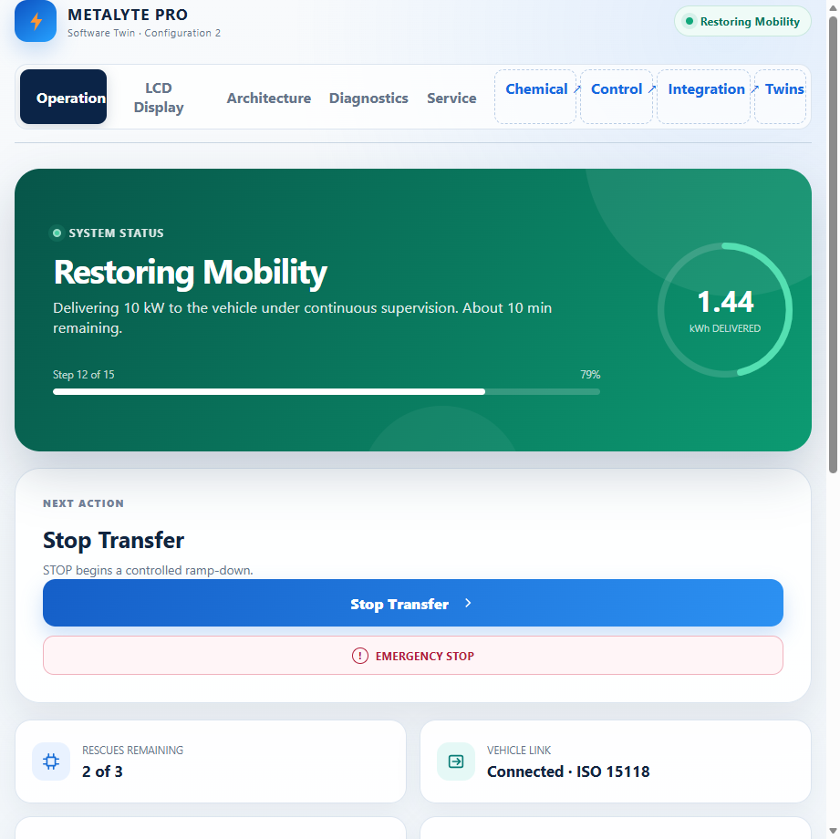
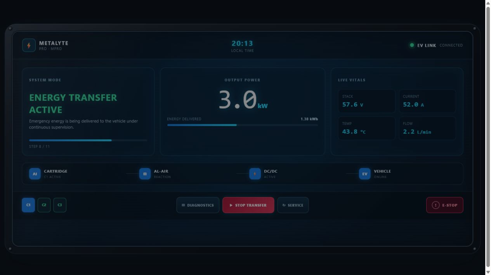
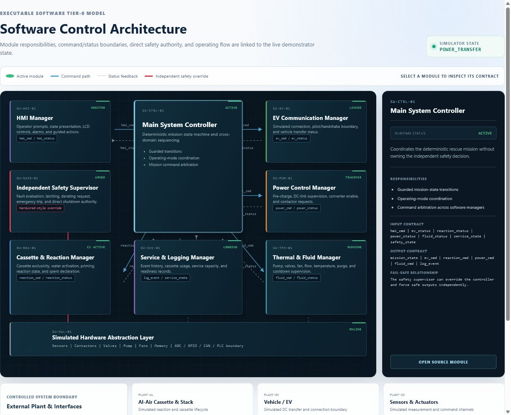

# Metalyte PRO-MPRO software concept demonstrator

This repository contains an executable, academic Tier-0 software concept for
the Metalyte PRO-MPRO emergency EV mobility-restoration system. It demonstrates
mission sequencing, three-cassette state management, simulated power transfer,
independent safety override, purge/cooldown, service lockout, and event logging.

> **Important:** This is not production firmware, a real EV charger, a CCS2
> implementation, a functional-safety implementation, hardware-control
> software, or a controller suitable for real electrochemical equipment. All
> thresholds, measurements, timings, and actuator commands are simulated
> placeholders and must not be used to operate hardware.

## Public interactive system

The browser-based concept system is published at:

**https://lpro402.github.io/Conceptual_Design/**

For a presentation-ready operating screen, open:

**https://lpro402.github.io/Conceptual_Design/?scenario=charging**

For the standalone physical LCD concept, open:

**https://lpro402.github.io/Conceptual_Design/?scenario=charging&view=lcd**

For the live Software Tier-0 architecture, open:

**https://lpro402.github.io/Conceptual_Design/?scenario=charging&view=architecture**

The public interface is a self-contained static demonstrator with five views:

- **Operation** — a guided rescue mission with one primary action per state.
- **LCD Display** — a compact physical-screen concept synchronized with the
  same state machine, measurements, cartridge lifecycle, and safety override.
- **Architecture** — an interactive Software Tier-0 model whose active modules,
  mission phase, safety authority, contracts, and source-code links follow the
  running simulation.
- **Diagnostics** — live simulated measurements, fault injection, safety-chain
  response, actuator commands, and event logging.
- **Service** — cartridge readiness, service capacity, and the conceptual
  closed-loop replacement and recycling process.

The static public interface and the Python/Streamlit engineering demonstrator
represent the same Tier-0 logic. The public interface is optimized for reports,
presentations, and sharing; Streamlit remains the executable Python reference.







The repository organization is temporary. It is not a product tree, PBS, BOM,
ICD, or N-squared model.

## Architecture summary

The demonstrator separates mission control from the independent safety path:

- `MainSystemController` owns deterministic mission sequencing.
- `IndependentSafetySupervisor` evaluates critical conditions and can override
  the main controller.
- `CassetteReactionManager` enforces one active cassette and the
  `DRY_READY -> SELECTED -> ACTIVATING -> ACTIVE -> SPENT` lifecycle.
- `PowerControlManager` simulates pre-charge, contactors, converter enable, and
  controlled/emergency shutdown.
- `ThermalFluidManager` simulates water, pump, fan, ventilation, and purge.
- `EVCommunicationManager`, `HMIManager`, `ServiceLoggingManager`, and the
  simulated HAL provide the remaining Tier-0 responsibilities.

The main nominal sequence is:

```text
STANDBY -> WAKE_UP_SELF_TEST -> VEHICLE_CONNECTION
-> CASSETTE_SELECTION -> WATER_ACTIVATION -> PRIMING
-> PRE_CHARGE -> POWER_TRANSFER -> RAMP_DOWN
-> PURGE_COOLDOWN -> READY or SERVICE_REQUIRED
```

Critical injected faults lead to `EMERGENCY_SHUTDOWN`; faults remain latched
until the demonstrator is reset.

## Requirements

- Python 3.12+
- Streamlit 1.x
- pytest 8.x (for tests)

## Installation

```powershell
python -m venv .venv
.\.venv\Scripts\Activate.ps1
python -m pip install -e ".[test]"
```

## Run the dashboard

```powershell
python -m streamlit run software_demo/app.py
```

The dashboard opens locally in a browser. Follow the numbered controls from
Wake Up through power transfer, then use Stop and Advance Shutdown Step to
observe ramp-down and purge before returning to Ready.

To preview the public static interface locally:

```powershell
python -m http.server 8770 --directory docs
```

Then open `http://127.0.0.1:8770/`.

## Run tests

```powershell
python -m pytest
```

## Word-ready link and screenshot

Use the public link above as a clickable hyperlink in Word. The controlled
dashboard image is available at:

`https://lpro402.github.io/Conceptual_Design/assets/metalyte_hmi_dashboard.png`

The standalone physical LCD image is available at:

`https://lpro402.github.io/Conceptual_Design/assets/metalyte_lcd_display.png`

The Software Tier-0 architecture image is available at:

`https://lpro402.github.io/Conceptual_Design/assets/metalyte_software_architecture.png`

To refresh the image after a UI change:

1. Open the public or local static interface with `?scenario=charging`.
2. Set the browser to a 16:9 window.
3. Capture the system overview in `STANDBY` or `POWER_TRANSFER`.
4. Inject a fault and capture the red safety panel and event log.
5. Store selected images under `exports/figures/` only when they are intended
   as controlled report artifacts (generated exports are ignored by default).

## Example scenarios

JSON scenario descriptions are stored in `software_demo/scenarios/`. They
document normal and fault demonstrations; the UI also supports manual actions.

## Known limitations

- There is no real CCS2, PLC, HVIL, contactor, sensor, pump, fan, or valve I/O.
- No thresholds have been validated against a physical system.
- Timing is user-stepped rather than real-time.
- The simulated electrical and electrochemical values are illustrative only.
- Reset clears the academic demonstrator; it does not represent a real service
  or fault-clear procedure.
- This is not an RTOS design and makes no task-scheduling claim.

## Relationship to other Tier-0 work

- **Mechanical:** consumes conceptual packaging and handling context only.
- **Electronic:** mirrors the conceptual controller, safety, power, and sensor
  responsibilities without selecting components.
- **Electrochemical:** represents cassette lifecycle and reaction enablement,
  not chemical kinetics.
- **Thermal:** represents flow, fan, purge, temperature, and derating signals,
  not a validated heat-transfer model.

See `docs/architecture/` for the software architecture and safety rationale.
