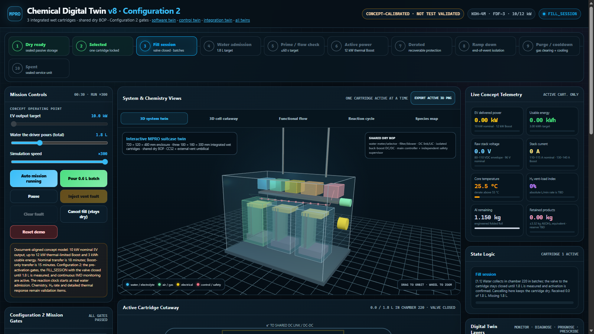
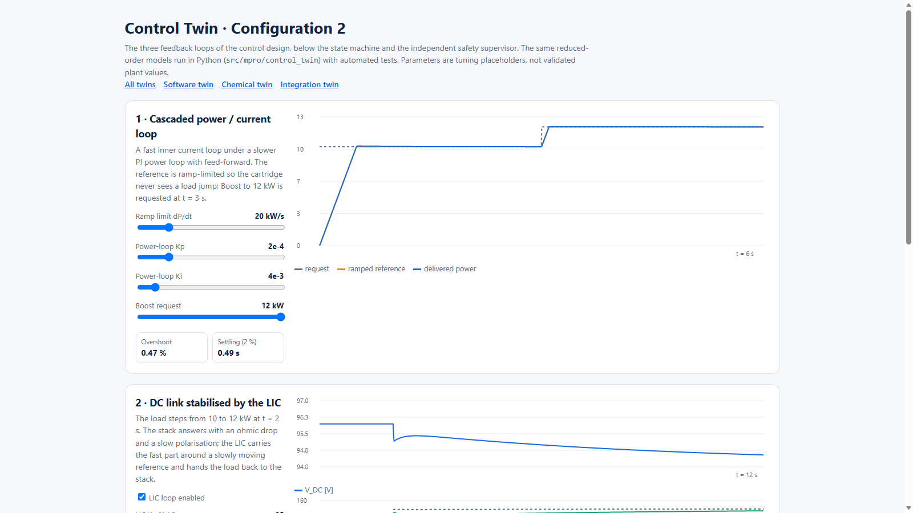

# Metalyte PRO-MPRO — Configuration 2 digital twins

Executable digital twins of the Metalyte PRO-MPRO emergency EV
mobility-restoration system, alternative 1, **Configuration 2**: three dry,
water-activated aluminium-air cartridges (3 kWh each, one active at a time)
delivering 10 kW — up to 12 kW thermal-limited Boost — through a 96 V DC link,
an LIC buffer and an isolated DC/DC converter to a CCS2 vehicle inlet.

> **Academic concept twins.** Not firmware, not a charger, not a CCS2 stack, not
> a functional-safety design and not test evidence. Every value is a Tier 0–1
> design value or a labelled simulation placeholder.

## Open the twins

| Twin | Link | What it shows |
|---|---|---|
| All twins | **https://lpro402.github.io/Conceptual_Design/hub.html** | Entry point and how the twins connect |
| Software twin | **https://lpro402.github.io/Conceptual_Design/** | 15-step Configuration 2 mission, LCD, architecture, diagnostics, service |
| HMI screen twin | **https://lpro402.github.io/Conceptual_Design/?view=lcd** | The suitcase display: Configuration 2 operator messages (Hebrew), fill gauge, permissives, E-STOP |
| Chemical twin | **https://lpro402.github.io/Conceptual_Design/chemical-twin/** | 3D system and cartridge, reactions, mission gates, fill session, twin layers |
| Control twin | **https://lpro402.github.io/Conceptual_Design/control-twin/** | Power/current, LIC DC-link and thermal loops with live tuning |
| Integration twin | **https://lpro402.github.io/Conceptual_Design/integration-twin/** | Integration levels L0–L3, threads T1–T7, gates, fault injection |

Presentation links kept from earlier versions:
`?scenario=charging`, `?scenario=charging&view=lcd`,
`?scenario=charging&view=architecture`.






## Repository layout

```text
src/mpro/
  baseline.json        single design baseline shared by all twins
  chemical_twin/       cartridge plant: polarisation, Al/H₂O/O₂ mass balance, H₂, thermal
  software_twin/       Configuration 2 state machine, safety supervisor, fill session, storage
  control_twin/        power/current, LIC DC-link and thermal loops (design 4.3)
  twin_services/       monitoring · diagnostics · prognostics · prescriptive · UQ emulator
scenarios/             15 JSON demonstrations (one per Configuration 2 change + fault paths)
apps/
  software_twin_app.py Streamlit operator console (software twin on the chemical twin)
  chemical_twin_study.py  scenarios + LHS / Gaussian-process uncertainty study
docs/                  GitHub Pages site (the four web twins) and architecture notes
tests/                 twins, web-page consistency and repository guard
```

## Configuration 2 in the software twin

| Change | Behaviour | Scenario |
|---|---|---|
| 1.1–1.3 | `FILL_SESSION`: batch pouring into chamber 220, valve closed until 1.8 L is measured and confirmed; restart forces re-measure; cancel keeps the cartridge dry; > 2.2 L rejected | 02, 03, 04 |
| 2.1 | `AWAIT_DEPLOY`: cable + vent signals **and** driver confirmation | 05 |
| 4.1, 5.2 | `ENVIRONMENT_CHECK`: enclosed space blocks; wall requires diffuser on open side; obstructed vents require clearing cargo | 06 |
| 8.1, 8.3 | HVIL window, CP level, IMD warning/block before and during transfer; ISO 15118 → DIN 70121 on communication failure only | 07–10 |
| 9.1 | Standby wake sources, D-BIT interval, temperature-compensated self-test | 14 |
| 7.1 | Thermal: Boost disable 52 °C, derate 55 °C, shutdown 65 °C | 15 |

See [docs/architecture/state_machine.md](docs/architecture/state_machine.md),
[docs/architecture/safety_supervisor.md](docs/architecture/safety_supervisor.md)
and [docs/architecture/digital_twins.md](docs/architecture/digital_twins.md).

## Run locally

```powershell
python -m venv .venv
.\.venv\Scripts\Activate.ps1
python -m pip install -e ".[test,app,study]"
python -m pytest                                   # all twins + web consistency + guard
python -m streamlit run apps/software_twin_app.py  # operator console
python apps/chemical_twin_study.py                 # UQ study → exports/chemical_twin/
python -m http.server 8770 --directory docs        # web twins at http://127.0.0.1:8770/
```

Run a single demonstration scenario:

```powershell
python -c "from pathlib import Path; from mpro.software_twin import scenario; print(scenario.run(Path('scenarios/02_batch_fill_pause_restart.json')).state)"
```

## Content policy

This repository contains software and code only. Project documents, tables,
course material, lecture slides, datasheets and CAD files are not stored here;
`tests/test_repository_guard.py` enforces it.
